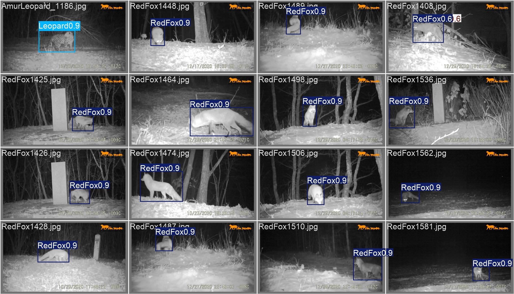
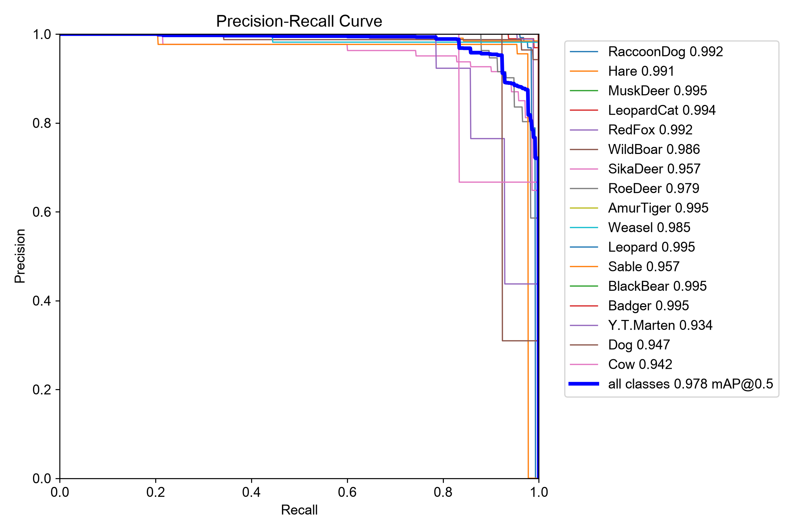
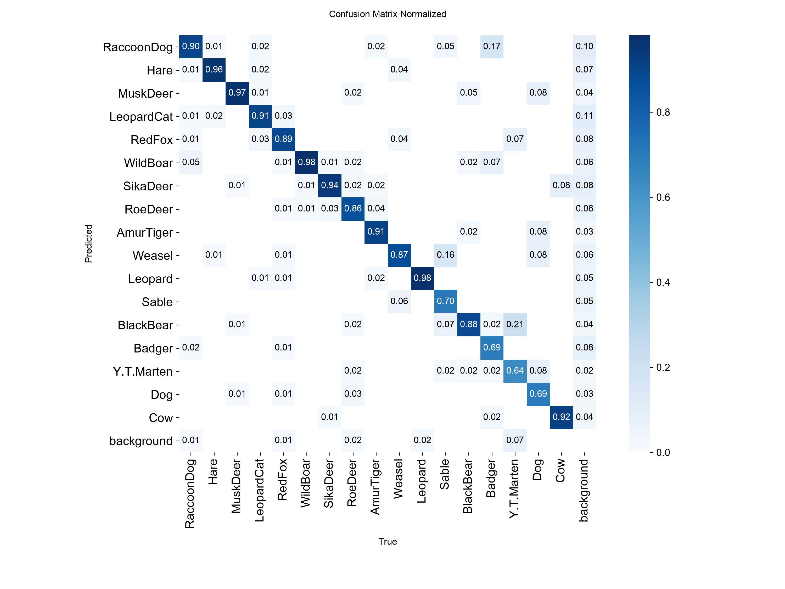
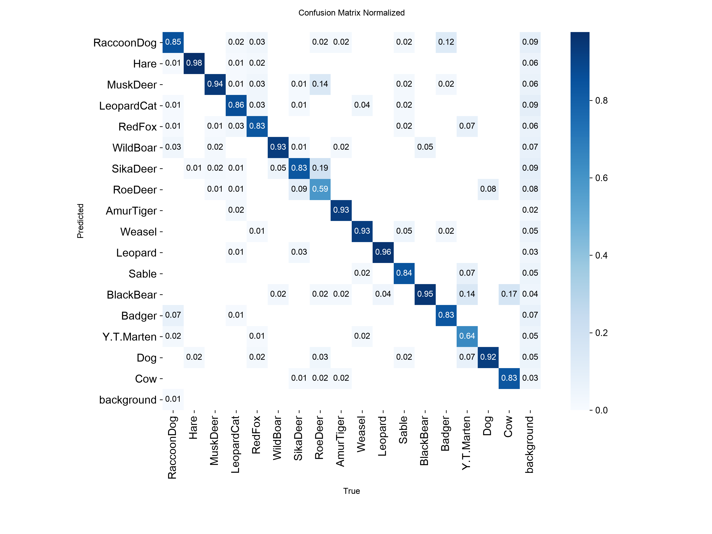

# AI-Driven Wildlife Recognition Under Low-Light Conditions
## Data Augmentation and Attention-Enhanced YOLOv8 for Camera-Trap Animal Detection

[](https://classroom.github.com/a/-bKyY6qM)
[](https://classroom.github.com/online_ide?assignment_repo_id=24125444&assignment_repo_type=AssignmentRepo)

---

## Table of Contents

1. [Overview](#overview)
2. [Installation and Setup](#installation-and-setup)
3. [Directory Structure](#directory-structure)
4. [Methodology](#methodology)
5. [Future Enhancements](#future-enhancements)
6. [Poster](#poster)
7. [References](#references)
8. [Authors / Contributors](#authors--contributors)

---

## Overview

An end-to-end pipeline for detecting wildlife species in **nighttime infrared camera-trap footage**, built on **YOLOv8s**. It covers everything from raw annotation cleanup through two rounds of targeted data augmentation, to a custom attention-based architecture change (**CA-CBAM**) and a loss-function experiment (**Focal Loss**) - with every stage measured against the same held-out validation/test split so the effect of each change is directly comparable.

Infrared camera traps are a standard tool for automated biodiversity monitoring, but nighttime frames are a genuinely hard input for object detectors:

- **Degraded signal** -  IR frames lose most contrast and all color information.
- **Habitat occlusion** - branches, grass, and shadow frequently cover part of the animal.
- **Near-identical silhouettes** - visually similar species (e.g. Red Fox vs. Amur Tiger, Raccoon Dog vs. Dog) become much harder to tell apart once colour is gone.
- **Long-tailed class imbalance** - a handful of species (Y.T. Marten, Dog, Cow) have far fewer labeled examples than the rest.

The project's core research question: **can targeted data augmentation and coordinate-aware attention mechanisms improve YOLOv8's detection robustness on nocturnal and rare wildlife, specifically?**

### Experimental Pipeline

| Stage | Change | Goal |
|---|---|---|
| Raw | Pascal VOC → YOLO conversion, stratified 70/20/10 split | Clean, reproducible baseline dataset |
| V1 | + Photometric augmentation (Gamma / CLAHE / Brightness-Contrast), class-aware probability | Simulate illumination variation without touching box geometry |
| V2 | + BBox-aware CutOut, targeting the hardest classes | Simulate partial occlusion (branches, vegetation) |
| V3 | + CA-CBAM attention module at P3/P4/P5 | Let the backbone attend to *where* and *what* matters more explicitly |
| V4 | + Focal Loss (γ=2.0, α=0.25) on top of V3 | Test whether down-weighting easy negatives helps the minority classes further |

### Results and Observations

Five trained YOLOv8s variants (raw, V1, V2, V3, V4), each with full validation/test metrics (mAP50, mAP50-95, precision, recall) and per-class breakdowns. The headline result: **CA-CBAM (V3) achieves the best test mAP50 (0.9783)** and produces real per-class recall gains on historically hard classes (Dog +23pp, Sable +14pp, Weasel +6pp vs. the V2 baseline), but does **not** improve mAP50-95 over the plain baseline, and adding Focal Loss on top (V4) *hurts* rather than helps. Full numbers in [Methodology → Results](#results).


*Sample detections from the CA-CBAM (V3) model on unseen nighttime test frames.*

---

## Installation and Setup

This project spans two execution environments:

- **Dataset-processing scripts** (`dataset_processing/`) were run **locally** (Python 3, CPU for VOC→YOLO conversion, splitting, or augmentation).
- **Model training notebooks** (`notebooks/`) were run **on Kaggle**, using Kaggle's GPU runtime, with datasets mounted from Kaggle Datasets (see [Methodology](#methodology) for links) at `/kaggle/input/` and outputs written to `/kaggle/working/`.

### 1. Local environment setup

```bash
git clone https://github.com/ACM40960/projects-harshini-jayakumar-zhongjian-zhang.git
cd projects-harshini-jayakumar-zhongjian-zhang
python -m venv .venv
source .venv/bin/activate
pip install -r requirements.txt
```

Tested with `ultralytics==8.4.108`, `torch==2.13.0` (see [requirements.txt](requirements.txt) for the full pinned list).

### 2. Dataset

**Download the raw dataset.** Get the original NTLNP nighttime camera-trap dataset from [huggingface.co/datasets/myyyyw/NTLNP](https://huggingface.co/datasets/myyyyw/NTLNP/blob/main/voc_night.rar) and place it at `datasets/raw-dataset/`, so that `datasets/raw-dataset/Annotations/` and `datasets/raw-dataset/JPEGImages/` exist - this is the path every script below reads from via `config.py`.
Run the following **in order**, from within each script's own folder (each resolves shared paths via `dataset_processing/config.py`):

```bash
cd dataset_processing/raw_data-to-yolo_format
python 01_analyze_voc_dataset.py
python 02_convert_voc_to_yolo.py
python 03_split_dataset.py
python 04_analyze_split_distribution.py

cd ../V1-data_augmentation
python 05_augment_train_dataset.py
python 06_verify_yolo_dataset.py

cd ../V2-data_augmentation
python 07_augment_v2_bbox_cutout.py
python 08_verify_v2_yolo_dataset.py
```

This regenerates `datasets/yolo_dataset/` (raw), `datasets/enhanced_yolo_dataset/` (V1), and `datasets/enhanced_yolo_dataset_v2/` (V2) locally. `datasets/` is not tracked in git (~14GB) - full details and per-stage statistics are in [dataset_processing/Dataset_Readme.md](dataset_processing/Dataset_Readme.md).

### 3. Training on Kaggle

Each notebook under `notebooks/` is written to run **on Kaggle**:
- Data is read from `/kaggle/input/datasets/jharshin/<dataset-slug>/...` (see [Methodology](#methodology) for the exact Kaggle Dataset links).
- Outputs (weights, plots, metrics) are written to `/kaggle/working/`.
- To reproduce: upload the notebook to Kaggle, attach the corresponding dataset as input, enable a GPU accelerator, and run all cells. Training config is fixed across every run for comparability: **100 epochs, image size 640×640, batch size 16, patience 20, seed 42**.

| Notebook | Trains |
|---|---|
| [notebooks/baseline_models/yolov8-on-rawdata.ipynb](notebooks/baseline_models/yolov8-on-rawdata.ipynb) | YOLOv8s baseline on raw data |
| [notebooks/baseline_models/yolov8-on-v1data.ipynb](notebooks/baseline_models/yolov8-on-v1data.ipynb) | YOLOv8s baseline on V1 data |
| [notebooks/baseline_models/yolov8-on-v2data.ipynb](notebooks/baseline_models/yolov8-on-v2data.ipynb) | YOLOv8s baseline on V2 data |
| [notebooks/ca-cbam/ca-cbam-yolov8.ipynb](notebooks/ca-cbam/ca-cbam-yolov8.ipynb) | YOLOv8s + CA-CBAM (V3) on V2 data |
| [notebooks/ca-cbam/ca-cbam-focal-loss.ipynb](notebooks/ca-cbam/ca-cbam-focal-loss.ipynb) | YOLOv8s + CA-CBAM + Focal Loss (V4) on V2 data |

### 4. Skip training - use the released weights

Trained `best.pt` checkpoints for **all 5 experiments** are attached as [GitHub Release assets](../../releases). Download the release matching the run you want.

**Running inference** - baseline checkpoints load directly:

```python
from ultralytics import YOLO
model = YOLO("yaml_and_weights/v2-enhanced-data/weights/best.pt")
model.predict(source="path/to/image.jpg", save=True, conf=0.25)
```

CA-CBAM checkpoints (V3, V4) need the custom `CoordinateCBAM` module registered with Ultralytics **before** loading - it's a custom class, not part of the base library, so the checkpoint's unpickler can't resolve it otherwise:

```python
import torch
import torch.nn as nn
from ultralytics import YOLO
import ultralytics.nn.tasks as tasks


class ChannelAttention(nn.Module):
    def __init__(self, channels, reduction=16):
        super().__init__()
        hidden = max(channels // reduction, 1)
        self.avg_pool = nn.AdaptiveAvgPool2d(1)
        self.max_pool = nn.AdaptiveMaxPool2d(1)
        self.mlp = nn.Sequential(
            nn.Conv2d(channels, hidden, 1, bias=False),
            nn.ReLU(inplace=True),
            nn.Conv2d(hidden, channels, 1, bias=False),
        )
        self.sigmoid = nn.Sigmoid()

    def forward(self, x):
        avg = self.mlp(self.avg_pool(x))
        max_val = self.mlp(self.max_pool(x))
        return self.sigmoid(avg + max_val)


class SpatialAttention(nn.Module):
    def __init__(self, kernel_size=7):
        super().__init__()
        padding = kernel_size // 2
        self.conv = nn.Conv2d(2, 1, kernel_size, padding=padding, bias=False)
        self.sigmoid = nn.Sigmoid()

    def forward(self, x):
        avg = torch.mean(x, dim=1, keepdim=True)
        max_val, _ = torch.max(x, dim=1, keepdim=True)
        attention = torch.cat([avg, max_val], dim=1)
        return self.sigmoid(self.conv(attention))


class CoordinateAttention(nn.Module):
    def __init__(self, channels, reduction=32):
        super().__init__()
        hidden = max(channels // reduction, 8)
        self.conv1 = nn.Conv2d(channels, hidden, kernel_size=1, bias=False)
        self.bn1 = nn.BatchNorm2d(hidden)
        self.act = nn.Hardswish()
        self.conv_h = nn.Conv2d(hidden, channels, kernel_size=1, bias=False)
        self.conv_w = nn.Conv2d(hidden, channels, kernel_size=1, bias=False)
        self.sigmoid = nn.Sigmoid()

    def forward(self, x):
        identity = x
        b, c, h, w = x.size()
        x_h = torch.mean(x, dim=3, keepdim=True)
        x_w = torch.mean(x, dim=2, keepdim=True)
        x_w = x_w.permute(0, 1, 3, 2)
        y = torch.cat([x_h, x_w], dim=2)
        y = self.conv1(y)
        y = self.bn1(y)
        y = self.act(y)
        x_h, x_w = torch.split(y, [h, w], dim=2)
        x_w = x_w.permute(0, 1, 3, 2)
        a_h = self.sigmoid(self.conv_h(x_h))
        a_w = self.sigmoid(self.conv_w(x_w))
        return identity * a_h * a_w


class CoordinateCBAM(nn.Module):
    def __init__(self, channels):
        super().__init__()
        self.coordinate = CoordinateAttention(channels)
        self.channel = ChannelAttention(channels)
        self.spatial = SpatialAttention()

    def forward(self, x):
        x = self.coordinate(x)
        x = x * self.channel(x)
        x = x * self.spatial(x)
        return x


tasks.CoordinateCBAM = CoordinateCBAM
model = YOLO("yaml_and_weights/v4-ca_cbam-loss/weights/best.pt")
model.predict(source="path/to/image.jpg", save=True, conf=0.25)
```

---

## Directory Structure

```text
.
├── dataset_processing/              # VOC->YOLO pipeline (run locally)
│   ├── config.py                    # shared paths, class names, seed
│   ├── raw_data-to-yolo_format/     # 01-04: analyze, convert, split, verify distribution
│   ├── V1-data_augmentation/        # 05-06: photometric augmentation + verification
│   ├── V2-data_augmentation/        # 07-08: bbox-aware CutOut augmentation + verification
│   └── Dataset_Readme.md            # full dataset documentation
├── datasets/                        # generated datasets (not tracked in git, ~14GB)
│   ├── raw-dataset/                 # original Pascal VOC source (Annotations/, JPEGImages/)
│   ├── yolo_dataset/                # raw, converted to YOLO format
│   ├── enhanced_yolo_dataset/       # V1: + photometric augmentation
│   └── enhanced_yolo_dataset_v2/    # V2: + bbox-aware CutOut
├── notebooks/                       # training notebooks (run on Kaggle)
│   ├── baseline_models/             # YOLOv8s baseline: raw / v1 / v2 data
│   └── ca-cbam/                     # V3: CA-CBAM, V4: CA-CBAM + focal loss
├── yaml_and_weights/                # architecture YAMLs + trained weights, one folder per run
│   ├── raw_data/, v1-enhanced-data/, v2-enhanced-data/   # baseline runs
│   ├── v3-ca_cbam/                  # CA-CBAM architecture YAML + weights
│   └── v4-ca_cbam-loss/             # CA-CBAM + focal loss architecture YAML + weights
├── results/
│   ├── experiment_results_*.csv     # summary metrics per run
│   ├── runs-baseline/detect/        # baseline val/test plots + curated predictions
│   └── runs-ca_cbam/detect/         # CA-CBAM val/test plots + curated predictions
├── requirements.txt
└── .gitignore
```

---

## Methodology

### Dataset

Nighttime infrared camera-trap images collected in the **Northeast Tiger and Leopard National Park (NTLNP)**, covering 17 animal species.

| Property | Value |
|---|---:|
| Images | 10,344 |
| Annotated objects | 10,699 |
| Classes | 17 |
| Split | 70% train / 20% val / 10% test (stratified, seed 42) |
| Source annotation format | Pascal VOC XML → YOLO `.txt` |

**Species:** RaccoonDog, Hare, MuskDeer, LeopardCat, RedFox, WildBoar, SikaDeer, RoeDeer, AmurTiger, Weasel, Leopard, Sable, BlackBear, Badger, Y.T.Marten, Dog, Cow. The distribution is long-tailed - Y.T.Marten, Dog, and Cow are the rarest classes and are the ones both augmentation stages specifically target with higher augmentation probability. Full per-stage statistics and verification reports: [dataset_processing/Dataset_Readme.md](dataset_processing/Dataset_Readme.md).

**Dataset links:**

| Version | Description | Link |
|---|---|---|
| Original source | Full NTLNP camera-trap dataset (only nighttime subset used here) | [huggingface.co/datasets/myyyyw/NTLNP](https://huggingface.co/datasets/myyyyw/NTLNP/blob/main/voc_night.rar) |
| Raw (YOLO format) | Converted + split, no augmentation | [kaggle.com/datasets/jharshin/raw-dataset](https://www.kaggle.com/datasets/jharshin/raw-dataset) |
| V1 (photometric aug.) | + Gamma / CLAHE / Brightness-Contrast on training set | [kaggle.com/datasets/jharshin/v1-enhanced-dataset](https://www.kaggle.com/datasets/jharshin/v1-enhanced-dataset) |
| V2 (+ BBox-aware CutOut) | + occlusion augmentation on hardest classes | [kaggle.com/datasets/jharshin/v2-enhanced-dataset](https://www.kaggle.com/datasets/jharshin/v2-enhanced-dataset) |

### YOLOv8s

All five experiments use **YOLOv8s** (Ultralytics) as the base detector, trained with an identical configuration for fair comparison: 100 epochs, image size 640×640, batch size 16, early-stopping patience 20, seed 42.

### CA-CBAM

`CoordinateCBAM` is a custom attention block inserted into the YOLOv8s backbone at the **P3, P4, and P5** stages, combining three attention gates applied in sequence:

1. **Coordinate Attention** - pools along height and width separately (rather than globally), preserving spatial position information instead of collapsing it.
2. **Channel Attention** - standard CBAM channel gate (average + max pooled MLP).
3. **Spatial Attention** - standard CBAM spatial gate (7×7 convolution over average/max channel maps).

Defined in [notebooks/ca-cbam/ca-cbam-focal-loss.ipynb](notebooks/ca-cbam/ca-cbam-focal-loss.ipynb); architecture YAMLs under [yaml_and_weights/v3-ca_cbam/yolov8s_ca_cbam.yaml](yaml_and_weights/v3-ca_cbam/yolov8s_ca_cbam.yaml) and [yaml_and_weights/v4-ca_cbam-loss/yolov8s_ca_cbam-v4.yaml](yaml_and_weights/v4-ca_cbam-loss/yolov8s_ca_cbam-v4.yaml).

**Implementation note - pretrained weight transfer:** inserting `CoordinateCBAM` mid-backbone shifts every later layer's index, which silently breaks Ultralytics' name-based pretrained-weight matching. The default `.load()` call was found to transfer only **97/388** tensors, leaving most of the backbone and head randomly initialized instead of COCO-pretrained. An index-aware state-dict remap was implemented to restore correct correspondence between original and shifted layer indices, improving transfer to **349/388** tensors (only the new CA-CBAM modules and the 17-vs-80-class detection head remain untransferred, as expected). Both CA-CBAM models (V3, V4) were trained with this fix applied.

### Focal Loss

V4 additionally replaces the classification loss with **Focal Loss** (γ=2.0, α=0.25) to test whether stronger down-weighting of easy negatives helps the harder/minority classes further. Box and DFL losses are left unchanged.

### Results

| Model | Dataset | Val mAP50 | Val mAP50-95 | Test mAP50 | Test mAP50-95 |
|---|---|---:|---:|---:|---:|
| YOLOv8s baseline | Raw | 0.9779 | 0.8557 | 0.9757 | 0.8568 |
| YOLOv8s baseline | V1 (photometric aug.) | 0.9772 | 0.8527 | 0.9725 | 0.8547 |
| YOLOv8s baseline | V2 (+ CutOut aug.) | 0.9812 | 0.8579 | 0.9678 | 0.8475 |
| YOLOv8s + CA-CBAM (V3) | V2 | 0.9757 | 0.8480 | 0.9783 | 0.8461 |
| YOLOv8s + CA-CBAM + Focal Loss (V4) | V2 | 0.9469 | 0.8164 | 0.9570 | 0.8300 |



*Precision-recall curve for the best model (CA-CBAM, V3) on the test set, per class and mAP50 overall.*

Full metrics (precision/recall included) per run: [results/experiment_results_rawdata.csv](results/experiment_results_rawdata.csv), [v1data](results/experiment_results_v1data.csv), [v2data](results/experiment_results_v2data.csv), [v3](results/experiment_results_v3.csv), [v4](results/experiment_results_v4.csv).

<table>
<tr>
<td width="50%"></td>
<td width="50%"></td>
</tr>
<tr>
<td align="center"><em>Baseline (V2), test set</em></td>
<td align="center"><em>CA-CBAM (V3), test set</em></td>
</tr>
</table>

Normalized confusion matrices, baseline vs. CA-CBAM, on the same test set - the diagonal brightens for classes like Dog and Sable under CA-CBAM (V3), consistent with the recall gains below.

**Key findings:**
- Augmentation (V1, V2) alone barely moves the needle over the raw baseline - the plain YOLOv8s recipe is already strong on this dataset.
- CA-CBAM (V3) achieves the highest test mAP50 (0.9783) but does **not** improve mAP50-95 over the plain baseline - it helps loose localization, not tight box precision.
- CA-CBAM's gains show up **per-class**, not globally: recall improves on historically hard classes - **Dog (+23pp), Sable (+14pp), Weasel (+6pp)** vs. the V2 baseline - even though the aggregate mAP50-95 doesn't move.
- **Y.T. Marten stays hard (recall ≈ 0.64)** across every variant, and RedFox↔AmurTiger confusion persists in nighttime frames even in the best model.
- Adding Focal Loss on top of CA-CBAM (V4) *hurts* performance, particularly on minority classes - likely because YOLOv8's task-aligned assigner produces continuous, IoU-weighted soft targets, and Focal Loss's alpha/gamma weighting was validated on hard 0/1 labels, not soft ones.

---

## Future Enhancements

- **Isolate architecture from loss.** Isolate the effect of Focal Loss. Evaluate Focal Loss independently on the V2 YOLOv8s baseline without CA-CBAM, to determine whether V4's performance regression originates from Focal Loss itself or its interaction with CA-CBAM.
- **Targeted fixes for remaining hard classes.** Class-specific oversampling or hard-negative mining for Y.T. Marten and the RedFox/AmurTiger confusion pair, rather than relying on global augmentation and loss re-weighting alone.

---

## Poster

The project's research poster - covering the Raw/V1/V2/CA-CBAM performance comparison, difficult-class recall analysis, and error analysis - is available at [`poster/poster.pdf`](poster/poster.pdf).

---

## References

- Ghiasi, G., Cui, Y., Srinivas, A., Qian, R., Lin, T. Y., Cubuk, E. D., Le, Q. V., & Zoph, B. (2021). ”Simple copy-paste is a strong data augmentation method for instance segmentation.” In Proceedings of the IEEE/CVF CVPR, pp. 2918-2928.
- Hou, Q., Zhou, D., & Ji, M. (2021). ”Coordinate attention for efficient mobile network design.” In Proceedings of the IEEE/CVF CVPR, pp. 13713-13722.
- Hu, J., Shen, L., & Sun, G. (2018). ”Squeeze-and-excitation networks.” In Proceedings of the IEEE CVPR, pp. 7132-7141.
- Lin, T. Y., Goyal, P., Girshick, R., He, K., & Doll´ar, P. (2017). ”Focal loss for dense object detection.” In Proceedings of the IEEE ICCV, pp 2980-2988.
- Ultralytics. (2023). ”YOLOv8.” Ultralytics YOLO Documentation and GitHub Repository. Available at: https://github.com/ultralytics/ultralytics
- Wang, J., Wan, G., Yin, S., Zhang, Y., & Gao, F. (2024). ”Nighttime wildlife object detection based on YOLOv8-night.” Electronics Letters, 60(15), e13305.
- Woo, S., Park, J., Lee, J. Y., & Kweon, I. S. (2018). ”CBAM: Convolutional block attention module.” In Proceedings of the European Conference on Computer Vision (ECCV), pp. 3-19.

---

## Authors/ Contributors

| Name | Student ID | 
|---|---|
| Harshini Jayakumar | 25208476 |
| Zhongjian Zhang | 25223608 | 

